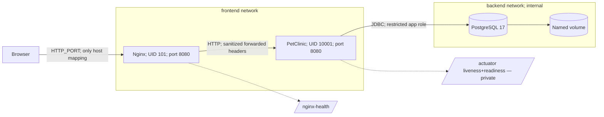
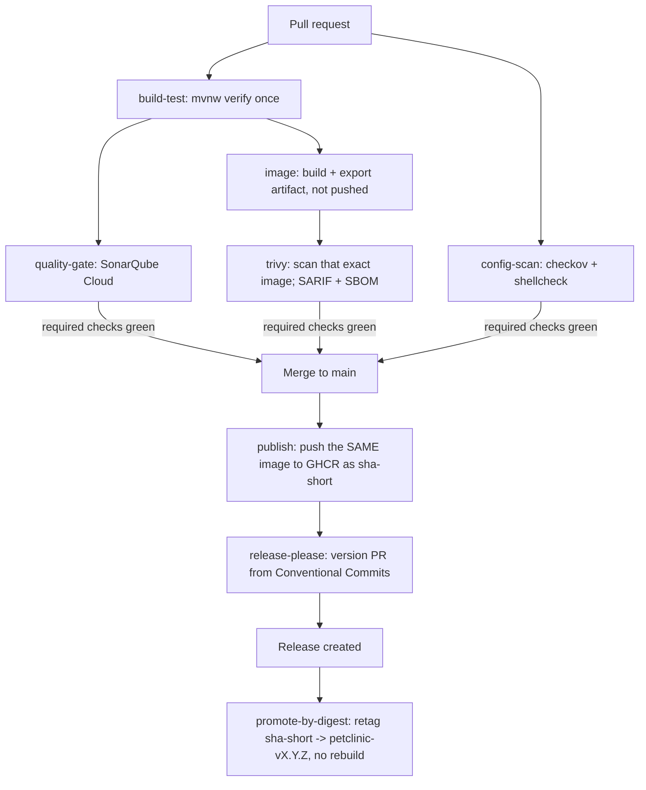

# PetClinic — Production Containerization Journey

> A production DevOps layer (Docker, Compose, Nginx, PostgreSQL, CI, IaC, Kubernetes) built on top of Spring's PetClinic sample app, milestone by milestone, without touching application code.


[](https://github.com/ThinkWithOps/thinkwithops-petclinic-production/releases)
[](https://github.com/ThinkWithOps/thinkwithops-petclinic-production/actions/workflows/ci.yml)
[](https://sonarcloud.io/summary/new_code?id=ThinkWithOps_thinkwithops-petclinic-production)

---

## Table of Contents

- [Project Description](#project-description)
- [Video Series](#video-series)
- [Attribution](#attribution)
- [Milestones](#milestones)
- [V1 — Containerized Runtime](#v1--containerized-runtime)
- [V1 Architecture](#v1-architecture)
- [V2 — CI/CD Pipeline](#v2--cicd-pipeline)
- [V2 Architecture](#v2-architecture)
- [Tech Stack](#tech-stack)
- [Prerequisites](#prerequisites)
- [Run Locally](#run-locally)
- [Validation](#validation)
- [What This Teaches](#what-this-teaches)
- [Project Structure](#project-structure)
- [Troubleshooting](#troubleshooting)
- [Command Reference](#command-reference)
- [License](#license)

---

## Project Description

This repo takes the upstream [Spring PetClinic](https://github.com/spring-projects/spring-petclinic) sample application — a Java 17 / Spring Boot 4.1.0 monolith — and builds a real production operational layer around it: hardened container image, PostgreSQL, Nginx reverse proxy, health-gated startup, externalized config, CI, and (in later milestones) cloud IaC and Kubernetes.

`src/main` and `src/test` are never modified. Everything under `docker/`, `scripts/`, `docs/`, `ci/`, the `Jenkinsfile`, and the workflow files is new, purpose-built DevOps work added on top of the copied application.

One repository, one continuous journey. Each milestone is an annotated Git tag + GitHub Release, and every previous milestone keeps working.

---

## Video Series

| Part | Tag | Video | Focus |
|---|---|---|---|
| V1 | [`v1-containerized`](https://github.com/ThinkWithOps/thinkwithops-petclinic-production/releases/tag/v1-containerized) | _coming soon_ | Hardened Docker image, PostgreSQL, Nginx reverse proxy, health-gated startup, first fully verified deploy |
| V2 | [`v2-cicd`](https://github.com/ThinkWithOps/thinkwithops-petclinic-production/tree/v2-cicd) | _coming soon_ | Build-once/promote-by-digest CI/CD: quality gate, vulnerability scanning, config scanning, semantic release, self-hosted Jenkins parity |

---

## Milestones

| Tag | Focus |
|---|---|
| [`v1-containerized`](https://github.com/ThinkWithOps/thinkwithops-petclinic-production/releases/tag/v1-containerized) | Hardened Docker image, PostgreSQL, Nginx, health-based startup — **verified** |
| [`v2-cicd`](https://github.com/ThinkWithOps/thinkwithops-petclinic-production/tree/v2-cicd) | Build-once/promote-by-digest CI/CD, quality/security gates, semantic release — **current** (GitHub Actions path verified; self-hosted Jenkins/Nexus path prepared, runtime verification pending) |
| `v3-aws-iac` | Terraform-provisioned AWS infrastructure |
| `v4-kubernetes` | Kubernetes deployment |

---

## Attribution

The application source (`src/*`, `pom.xml` build logic, Gradle files) is from [spring-projects/spring-petclinic](https://github.com/spring-projects/spring-petclinic), licensed under the [Apache License 2.0](LICENSE.txt). No application code was modified to build this DevOps layer.

Only the operational layer described in this README — `docker/`, `scripts/`, `docs/`, `ci/`, `Jenkinsfile`, `.github/workflows/` — is original work added on top.

---

## V1 — Containerized Runtime

Starting point: upstream PetClinic runs fine on a laptop (`./mvnw spring-boot:run`, in-memory H2) but has no production runtime — no hardened image, no real database, no reverse proxy, no health-based startup, implicit configuration.

V1 adds: a multi-stage hardened image, PostgreSQL wired through the existing `postgres` Spring profile, an Nginx reverse proxy as the single ingress point, Docker health checks gating startup order, and fully externalized configuration — with zero changes to application code.

## V1 Architecture



**Traffic path:** browser → Nginx (only published port) → PetClinic (Spring MVC/JPA) → PostgreSQL → named volume. Nginx sits only on `frontend`; PostgreSQL sits only on `backend`; the app bridges both. Neither app nor database ever publishes a host port.

**Startup ordering:** PostgreSQL health gates the app; app readiness (`readinessState,db`) gates Nginx. `depends_on: condition: service_healthy` at every hop.

**Security posture:** both app and Nginx run non-root, read-only root filesystem, dropped capabilities, no privilege escalation. `/actuator/**` is blocked at Nginx (upstream defaults to exposing everything) — health checks go straight to the container instead. Full write-up: [`docs/architecture/v1-containerized.md`](docs/architecture/v1-containerized.md).

Design decisions and trade-offs: [`docs/adr/`](docs/adr/) (base image/size budget, Nginx placement, actuator exposure, why V1 lives in `docker/` instead of replacing upstream's `docker-compose.yml`).

---

## V2 — CI/CD Pipeline

Starting point: V1 solved environment consistency, but building, testing, scanning, versioning, and releasing were all manual. Nothing prevented a vulnerable image, a failing quality gate, or an untested change from shipping — and there was no guarantee the image that was tested was the image that got released.

V2 adds: the container image is built once; every change is tested, quality-gated (SonarQube Cloud), security-scanned (Trivy for images/dependencies, Checkov for Dockerfile/workflow config), versioned (release-please, Conventional Commits), and promoted to a release tag **by digest, with no rebuild** — and, once branch protection is applied per [`docs/branch-protection.md`](docs/branch-protection.md) (not confirmed applied on this repo), PR merges are blocked on any gate failing. A self-hosted Jenkins + SonarQube + Nexus stack (`ci/`) runs an equivalent stage contract (differences listed in [`docs/ci-portability.md`](docs/ci-portability.md)) for environments without SaaS-runner access. Implementation prepared; runtime verification pending.

## V2 Architecture



**Build-once, promote-by-digest:** the image built and Trivy-scanned in the `image`/`trivy` jobs is the exact `image.tar` the `publish` job loads and pushes — never rebuilt. `release.yml` never runs `docker build`; it retags that same pushed digest to the release's semver tag and proves the digests match in the job log. Full write-up: [`docs/architecture/v2-cicd.md`](docs/architecture/v2-cicd.md).

### V2 status

| Area | Status |
|---|---|
| CI on `main` (`build-test`, `quality-gate`, `image`, `trivy`, `config-scan`, `publish`) | Verified on real GitHub Actions runs |
| Trivy blocks fixable CRITICAL CVEs | Verified — it caught 3 real Tomcat CVEs (now time-boxed in `.trivyignore`) |
| Release after CI, digest promotion without a rebuild | Verified on `petclinic-v1.1.0` (source and promoted digests match, shown in the job log) |
| Self-hosted Jenkins + SonarQube + Nexus (`ci/`, `Jenkinsfile`) | Implementation prepared; **runtime verification pending** a real Docker engine |
| A deliberately failing PR being blocked | Not tested |
| Branch protection / required checks (`docs/branch-protection.md`) | Documented, **not applied** to this repo (direct pushes to `main` are allowed) |

Details and the real first-run failures that were hit and fixed: [`docs/validation/v2-cicd.md`](docs/validation/v2-cicd.md).

Design decisions and trade-offs: [`docs/adr/`](docs/adr/) 0005-0009 (build-once/promote-by-digest, action pinning + SonarQube Cloud vs. self-hosted, Jenkins/Nexus scope + release-please over `versions-maven-plugin`, vulnerability acceptance policy, why upstream's workflows were removed). One-time setup (SonarCloud, org PR permissions, GHCR): [`docs/ci-setup.md`](docs/ci-setup.md). Required-checks setup: [`docs/branch-protection.md`](docs/branch-protection.md). Platform portability: [`docs/ci-portability.md`](docs/ci-portability.md).

---

## Tech Stack

| Technology | Role |
|---|---|
| Docker multi-stage build | Maven build stage → layered Spring Boot JRE runtime stage |
| Eclipse Temurin JRE (Alpine, digest-pinned) | Runtime image, non-root UID/GID 10001 |
| PostgreSQL 17 (digest-pinned) | Persistent relational data, restricted app role, named volume |
| Nginx unprivileged (digest-pinned) | Single ingress, header sanitation, actuator denial, own health check |
| Docker Compose v2 | Networks, health-gated startup order, resource limits, log rotation |
| Bash + `set -euo pipefail` | `deploy.sh` / `verify.sh` / `cleanup.sh` and their building blocks |
| Python 3 (stdlib only) | Static/runtime assertions called from the shell scripts |
| GitHub Actions | `ci.yml` (build/test/quality-gate/scan/publish), `release.yml` (release-please + digest promotion) |
| SonarQube Cloud + self-hosted SonarQube | PR-blocking quality gate (Cloud); Jenkins-path quality gate (local, via `ci/compose.yaml`) |
| Trivy | Image + dependency vulnerability scan, CycloneDX SBOM |
| Checkov | Dockerfile + GitHub Actions config scan |
| release-please | Conventional-Commits-driven semantic versioning, changelog, GitHub Releases |
| GHCR | Registry for the scanned image (`sha-<short>`) and the release tag (`petclinic-vX.Y.Z`) |
| Jenkins + Nexus (self-hosted, `ci/`) | Equivalent stage contract for environments without GitHub-hosted runners; Nexus holds versioned JARs. Prepared, not yet runtime-verified |

---

## Prerequisites

- Docker Engine + Compose v2 plugin + Buildx (for the BuildKit cache mount)
- `git`, `curl`, `python3`
- Linux amd64 engine (the pinned Alpine JRE image targets `linux/amd64`)
- Port `8080` free on host — some cloud/remote shells already bind a web terminal to it; check with `sudo ss -tlnp | grep 8080` and set `HTTP_PORT=8081` in `docker/.env` if occupied

No AWS/Azure/GCP account is needed for V1. V2's GitHub Actions path needs no local runtime at all (it runs entirely in CI). The self-hosted Jenkins stack needs a Linux Docker host with roughly 6 GB or more free RAM, `vm.max_map_count >= 262144`, and access to the host Docker socket — see [Run the self-hosted CI stack](#run-the-self-hosted-ci-stack-jenkins--sonarqube--nexus).

---

## Run Locally

```bash
git clone https://github.com/ThinkWithOps/thinkwithops-petclinic-production.git
cd thinkwithops-petclinic-production
./scripts/deploy.sh     # generates a private .env, builds the image, starts the stack
./scripts/verify.sh     # full functional + persistence validation
./scripts/cleanup.sh    # tear down; add --purge-data to also drop the DB volume
```

`deploy.sh` prints the URL once Nginx is healthy (defaults to `http://127.0.0.1:8080`).

### How releases work

Every PR runs `build-test` → `quality-gate` → `trivy` → `config-scan`. These are meant to be required checks (see [`docs/branch-protection.md`](docs/branch-protection.md)); that protection is documented but not applied to this repo yet. On merge to `main`, the exact image that was scanned is pushed to GHCR tagged `sha-<short>`.

`release.yml` starts only after `ci.yml` finishes successfully on `main` (a `workflow_run` trigger; running both on `push` raced, because the image did not exist yet when release started). release-please reads [Conventional Commits](https://www.conventionalcommits.org/) and keeps a release PR up to date; merging that PR cuts a GitHub Release tagged `petclinic-vX.Y.Z` and retags the already-scanned `sha-<short>` image to that version — no rebuild, same digest, with source and promoted digests printed in the job log.

- Releasable commits (mainly `feat:`, `fix:` and breaking changes) trigger a release PR; `docs:`, `chore:` and `ci:` do not, so squash-merge titles matter.
- release-please needs a `RELEASE_PLEASE_TOKEN` secret (a PAT); a PR opened with the default `GITHUB_TOKEN` never triggers CI. Setup: [`docs/ci-setup.md`](docs/ci-setup.md).
- Maven `SNAPSHOT` bump PRs are turned off (`skip-snapshot` in `release-please-config.json`), so there is one release PR per release.
- Current release: [`petclinic-v1.1.0`](https://github.com/ThinkWithOps/thinkwithops-petclinic-production/releases/tag/petclinic-v1.1.0). Full history: [`CHANGELOG.md`](CHANGELOG.md).

### Run the self-hosted CI stack (Jenkins + SonarQube + Nexus)

> **Status:** implementation prepared; runtime verification pending. The GitHub Actions path above is the verified one.

```bash
./scripts/ci-stack-up.sh          # creates ci/.env, builds Jenkins, starts the stack, prints first-run steps
./scripts/ci-stack-up.sh --down   # stop the stack (volumes kept)
```

What it needs and does:

- Linux Docker host, about 6 GB or more free RAM, `vm.max_map_count >= 262144` for SonarQube's embedded Elasticsearch (the script prints the `sysctl` command).
- Jenkins uses the **host** Docker daemon through `/var/run/docker.sock`; the script writes the socket's group ID to `ci/.env` as `DOCKER_GID`. Generated passwords stay in `ci/.env` (mode 0600, never committed).
- Manual first-run steps, printed by the script: create a SonarQube token and store it as the Jenkins credential `SONAR_TOKEN_LOCAL`; add the SonarQube webhook `http://jenkins:8080/sonarqube-webhook/` (without it the quality-gate stage times out); create a Nexus deploy user and store it as `NEXUS_DEPLOY_CREDENTIALS`.
- The seeded `petclinic-ci` job reads the `Jenkinsfile` from the `main` branch of this GitHub repo.
- Stages: verify → SonarQube → quality gate → image build → Trivy → Checkov + ShellCheck → SBOM → publish the tested JAR to Nexus. Differences from the GitHub Actions pipeline: [`docs/ci-portability.md`](docs/ci-portability.md).

---

## Validation

V1: [`docs/validation/v1-containerized.md`](docs/validation/v1-containerized.md) — container health, network isolation, non-root UIDs, actuator blocking, PostgreSQL persistence, measured image size.

V2: [`docs/validation/v2-cicd.md`](docs/validation/v2-cicd.md) — PR gating, digest-promotion proof, Jenkins/Nexus parity. **Partially verified**: `ci.yml` is green on real GitHub Actions runs and release digest-promotion is verified on `petclinic-v1.1.0`; the self-hosted Jenkins/Nexus path is **implementation prepared; runtime verification pending** (needs a real Docker engine with several GB of RAM). A deliberately failing PR and branch protection have not been tested or applied.

---

## What This Teaches

| What Was Built | Skill Demonstrated |
|---|---|
| Multi-stage Dockerfile (Maven build → Temurin JRE runtime) | Separating build toolchain from runtime image; layer caching with BuildKit cache mounts |
| Spring Boot layered jar extraction (`--layers --destination`) | Splitting dependency/loader/application layers so unchanged deps don't bust the Docker cache |
| Fixed non-root UID/GID + read-only root filesystem + dropped capabilities | Container hardening beyond "it runs," matching what a real security review checks |
| Digest-pinned base images in the app stack (`docker/`) | Reproducible builds — a tag can move underneath you, a digest can't. The self-hosted CI stack (`ci/`) pins Jenkins, SonarQube, Nexus and tool images by version tag only |
| Externalizing config via env vars into an *existing* Spring profile, without touching app code | Reading upstream source (`application-postgres.properties`) to find the real contract instead of guessing variable names |
| `depends_on: condition: service_healthy` chained three deep | Health-gated startup ordering — why "the app started" isn't the same as "the app is ready" |
| Nginx as the only ingress, `/actuator/**` denied at the proxy | Reducing attack surface at the network edge, not just in app config |
| Separate `frontend`/`backend` Docker networks, one marked `internal` | Network segmentation on a single Docker host, not just "everything on one bridge" |
| ADRs for every non-obvious decision (image choice, proxy placement, actuator exposure, repo layout) | Writing down *why*, with trade-offs and an enterprise-scale note — not just what |
| `verify.sh`'s HTTP-write → PostgreSQL-read → restart → persistence-check chain | Proving persistence actually works, not assuming a named volume is enough |
| Debugging a real `nginx -t` failure (unescaped `;` inside an unquoted regex terminating the directive early) | Reading nginx's actual error message and config-parsing rules instead of guessing at syntax |
| Debugging lost executable bits on `gradlew`/`mvnw`/shell scripts after a Windows checkout | Git file-mode tracking (`100644` vs `100755`) as a real cross-platform CI failure mode |
| Debugging a real deploy — port already bound by the host's own process, missing `python3` on a minimal image | Systematic diagnosis (`ss -tlnp`, `/etc/os-release`) instead of guessing fixes |
| Build once, scan that exact artifact, promote it by digest at release | Why "rebuild at release time" silently breaks the "tested image == shipped image" guarantee |
| Two SonarQube deployments for one quality gate (Cloud for PR decoration, local for the Jenkins path) | Matching the tool to what the runner can actually reach, not defaulting to "just self-host everything" |
| `.trivyignore`/`.checkov.yaml` with a justification/owner/expiry format per entry | Making *accepted* risk visible and time-boxed instead of a permanent, unexplained suppression |
| Removing `versions-maven-plugin` once `release-please` also writes `pom.xml`'s version | Recognizing a two-writer conflict before it causes a real version clobber, not after |
| Shipping a tag-only pin with an explicit TODO first, then closing it with real `gh api`-verified commit SHAs once network access existed | Honest documentation of a real gap beats a fake-looking "verified" pin at the time you can't check it — see ADR 0006 |
| Debugging a release-please PR that opened but showed zero CI checks | GitHub's anti-recursion guard: a PR opened by the default `GITHUB_TOKEN` never triggers other workflows — needs a PAT to look like a real user |
| Debugging Trivy failing silently mid-install with no error text | Not every `exit code 1` is the check working as designed — read past the summary to the actual tool output before assuming a real finding |
| Debugging `release.yml` failing with `manifest unknown` on every push | Two workflows triggered by the same `push` race: the release looked for an image CI had not pushed yet. `workflow_run` plus a `conclusion == 'success'` gate makes release wait for CI |
| A release PR that merged but never produced a tag | release-please only releases PRs labeled `autorelease: pending`; this one kept a stale `autorelease: snapshot` label from the earlier SNAPSHOT-bump PR whose branch it reused |
| Reading the actual job log after a "successful" release run | A green run can mean "nothing to do": the promote job was *skipped*, so green did not prove promotion — only the log lines `Digest equality proven` did |
| A real `.trivyignore` entry that did nothing because every line, including the CVE ID, was `#`-commented | The file's own header example was written as illustrative comment text — copying its shape without un-commenting the ID line silently no-ops the suppression |

---

## Project Structure

```
docker/
├── Dockerfile              # multi-stage build: Maven build → Temurin JRE runtime
├── compose.yaml             # app + postgres + nginx, health-gated startup
├── .env.example              # documents every variable, safe placeholders
├── nginx/                   # nginx.conf, conf.d/petclinic.conf, start.sh (envsubst)
└── postgres/                # init-app-user.sh — creates the restricted app role

scripts/
├── deploy.sh / verify.sh / cleanup.sh   # top-level: setup+build+run / validate / teardown
├── build.sh / run-local.sh / validate-local.sh   # building blocks the above wrap
├── setup-playground.sh       # preflight checks + private .env generation
├── static-check.sh           # shellcheck, bash -n, Compose config, no daemon required
├── check-runtime.py / check-static.py   # Python assertions used by the scripts above
└── lib/common.sh             # shared helpers (die, need, compose, config_value, ...)

docs/
├── architecture/v1-containerized.md, v2-cicd.md
├── adr/000{1..9}-*.md
├── validation/v1-containerized.md, v2-cicd.md
├── branch-protection.md      # required-checks setup, documented as steps
├── ci-portability.md         # stage contract mapped to GitLab CI syntax
├── ci-setup.md                # one-time SonarCloud/GitHub/GHCR setup, done once
└── troubleshooting.md

.github/workflows/
├── ci.yml         # build-test, quality-gate, image, trivy, config-scan, publish
└── release.yml    # release-please + promote-by-digest

ci/
├── compose.yaml               # Jenkins + SonarQube (+Postgres) + Nexus
├── jenkins/                   # Dockerfile (plugins + Docker CLI/Trivy/Checkov/ShellCheck baked in), plugins.txt, casc.yaml
├── settings.xml.template       # Maven->Nexus settings; filled from a Jenkins credential at deploy time
└── .env.example

Jenkinsfile                    # equivalent stage contract to ci.yml, for self-hosted runners
release-please-config.json / .release-please-manifest.json
CHANGELOG.md                   # maintained by release-please
.trivyignore / .checkov.yaml   # sonar.* config lives in pom.xml properties
```

---

## Troubleshooting

Symptom → cause → diagnosis → fix: [`docs/troubleshooting.md`](docs/troubleshooting.md).

---

## Command Reference

| Command | Purpose |
|---|---|
| `docker compose --env-file docker/.env -f docker/compose.yaml ps` | Check container status at a glance |
| `docker compose --env-file docker/.env -f docker/compose.yaml logs <service> --tail=50` | Tail recent logs for `app`, `postgres`, or `nginx` |
| `docker compose --env-file docker/.env -f docker/compose.yaml exec app sh` | Shell into the running app container |
| `docker compose --env-file docker/.env -f docker/compose.yaml exec postgres psql -U postgres -d petclinic` | Open a `psql` session against the database |
| `docker inspect <container> --format '{{json .State.Health}}'` | Full healthcheck history/output for one container |
| `sudo ss -tlnp \| grep <port>` | Find what's already bound to a port before changing `HTTP_PORT` |
| `docker image inspect petclinic:local --format 'Size: {{.Size}} bytes'` | Measured image size (see ADR 0001's budget) |
| `docker history --no-trunc petclinic:local` | Full per-layer size breakdown |
| `./scripts/static-check.sh` | Shellcheck + Compose config validation, no daemon required |
| `./mvnw -B -ntp verify` | Run the exact build-test stage CI runs (compile + test + coverage) |
| `trivy image --severity CRITICAL --ignore-unfixed <image>` | Reproduce the `trivy` CI job locally |
| `checkov --config-file .checkov.yaml` | Reproduce the `config-scan` CI job locally |
| `./scripts/ci-stack-up.sh` / `--down` | Bring up / tear down the self-hosted Jenkins + SonarQube + Nexus stack |
| `docker compose --env-file ci/.env -f ci/compose.yaml ps` | Health of the self-hosted CI stack's containers |
| `gh run list --workflow Release -R ThinkWithOps/thinkwithops-petclinic-production` | Recent release runs (a `skipped` run means CI did not succeed, not a failure) |
| `gh release list -R ThinkWithOps/thinkwithops-petclinic-production` | Published releases and their `petclinic-vX.Y.Z` tags |
| `docker buildx imagetools inspect ghcr.io/<repo>:<tag>` | Check a GHCR image's manifest digest (used to verify digest-promotion) |

---

## License

The PetClinic application is released under the [Apache License 2.0](LICENSE.txt), per upstream [spring-projects/spring-petclinic](https://github.com/spring-projects/spring-petclinic). The DevOps layer in this repository (`docker/`, `scripts/`, `docs/`, `ci/`, `Jenkinsfile`, workflow changes) is original work by this repository's author, provided as-is for portfolio/educational use.
