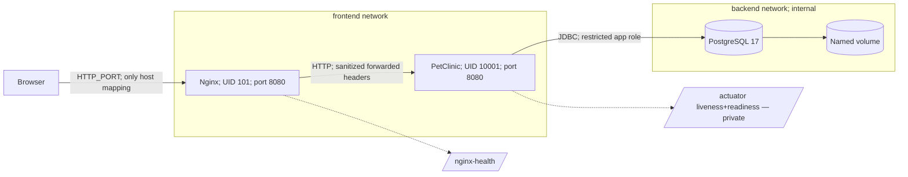

# PetClinic — Production Containerization Journey

> A production DevOps layer (Docker, Compose, Nginx, PostgreSQL, CI, IaC, Kubernetes) built on top of Spring's PetClinic sample app, milestone by milestone, without touching application code.


---

## Table of Contents

- [Project Description](#project-description)
- [Attribution](#attribution)
- [Milestones](#milestones)
- [V1 — Containerized Runtime](#v1--containerized-runtime)
- [V1 Architecture](#v1-architecture)
- [Tech Stack](#tech-stack)
- [Prerequisites](#prerequisites)
- [Run Locally](#run-locally)
- [Validation](#validation)
- [Project Structure](#project-structure)
- [Troubleshooting](#troubleshooting)
- [License](#license)

---

## Project Description

This repo takes the upstream [Spring PetClinic](https://github.com/spring-projects/spring-petclinic) sample application — a Java 17 / Spring Boot 4.1.0 monolith — and builds a real production operational layer around it: hardened container image, PostgreSQL, Nginx reverse proxy, health-gated startup, externalized config, CI, and (in later milestones) cloud IaC and Kubernetes.

`src/main` and `src/test` are never modified. Everything under `docker/`, `scripts/`, `docs/`, and the workflow files is new, purpose-built DevOps work added on top of the copied application.

One repository, one continuous journey. Each milestone is an annotated Git tag + GitHub Release, and every previous milestone keeps working.

| Tag | Focus |
|---|---|
| `v1-containerized` | Hardened Docker image, PostgreSQL, Nginx, health-based startup — **current** |
| `v2-cicd` | CI build/test/publish pipeline |
| `v3-aws-iac` | Terraform-provisioned AWS infrastructure |
| `v4-kubernetes` | Kubernetes deployment |

---

## Attribution

The application source (`src/*`, `pom.xml` build logic, Gradle files) is from [spring-projects/spring-petclinic](https://github.com/spring-projects/spring-petclinic), licensed under the [Apache License 2.0](LICENSE.txt). No application code was modified to build this DevOps layer.

Only the operational layer described in this README — `docker/`, `scripts/`, `docs/`, `.github/workflows/` — is original work added on top.

---

## V1 — Containerized Runtime

Starting point: upstream PetClinic runs fine on a laptop (`./mvnw spring-boot:run`, in-memory H2) but has no production runtime — no hardened image, no real database, no reverse proxy, no health-based startup, implicit configuration.

V1 adds: a multi-stage hardened image, PostgreSQL wired through the existing `postgres` Spring profile, an Nginx reverse proxy as the single ingress point, Docker health checks gating startup order, and fully externalized configuration — with zero changes to application code.

## V1 Architecture



**Traffic path:** browser → Nginx (only published port) → PetClinic (Spring MVC/JPA) → PostgreSQL → named volume. Nginx sits only on `frontend`; PostgreSQL sits only on `backend`; the app bridges both. Neither app nor database ever publishes a host port.

**Startup ordering:** PostgreSQL health gates the app; app readiness (`readinessState,db`) gates Nginx. `depends_on: condition: service_healthy` at every hop.

**Security posture:** both app and Nginx run non-root, read-only root filesystem, dropped capabilities, no privilege escalation. `/actuator/**` is blocked at Nginx (upstream defaults to exposing everything) — health checks go straight to the container instead. Full write-up: [`docs/architecture/v1-containerized.md`](docs/architecture/v1-containerized.md).

Design decisions and trade-offs: [`docs/adr/`](docs/adr/) (base image/size budget, Nginx placement, actuator exposure, why V1 lives in `docker/` instead of replacing upstream's `docker-compose.yml`).

---

## Tech Stack

| Technology | Role |
|---|---|
| Docker multi-stage build | Maven build stage → layered Spring Boot JRE runtime stage |
| Eclipse Temurin JRE (Alpine, digest-pinned) | Runtime image, non-root UID/GID 10001 |
| PostgreSQL 17 (digest-pinned) | Persistent relational data, restricted app role, named volume |
| Nginx unprivileged (digest-pinned) | Single ingress, header sanitation, actuator denial, own health check |
| Docker Compose v2 | Networks, health-gated startup order, resource limits, log rotation |
| Bash + `set -euo pipefail` | `deploy.sh` / `verify.sh` / `cleanup.sh` and their building blocks |
| Python 3 (stdlib only) | Static/runtime assertions called from the shell scripts |
| GitHub Actions | Maven/Gradle build workflows, actions pinned by commit SHA |

---

## Prerequisites

- Docker Engine + Compose v2 plugin + Buildx (for the BuildKit cache mount)
- `git`, `curl`, `python3`
- Linux amd64 engine (the pinned Alpine JRE image targets `linux/amd64`)

No AWS/Azure/GCP account is needed for V1.

---

## Run Locally

```bash
git clone <this-repo-url>
cd thinkwithops-petclinic-production
./scripts/deploy.sh     # generates a private .env, builds the image, starts the stack
./scripts/verify.sh     # full functional + persistence validation
./scripts/cleanup.sh    # tear down; add --purge-data to also drop the DB volume
```

`deploy.sh` prints the URL once Nginx is healthy (defaults to `http://127.0.0.1:8080`).

---

## Validation

Full checklist with expected output: [`docs/validation/v1-containerized.md`](docs/validation/v1-containerized.md). Covers container health, network isolation, non-root UIDs, actuator blocking, PostgreSQL persistence, and measured image size.

---

## Project Structure

```
docker/
├── Dockerfile              # multi-stage build: Maven build → Temurin JRE runtime
├── compose.yaml             # app + postgres + nginx, health-gated startup
├── .env.example              # documents every variable, safe placeholders
├── nginx/                   # nginx.conf, conf.d/petclinic.conf, start.sh (envsubst)
└── postgres/                # init-app-user.sh — creates the restricted app role

scripts/
├── deploy.sh / verify.sh / cleanup.sh   # top-level: setup+build+run / validate / teardown
├── build.sh / run-local.sh / validate-local.sh   # building blocks the above wrap
├── setup-playground.sh       # preflight checks + private .env generation
├── static-check.sh           # shellcheck, bash -n, Compose config, no daemon required
├── check-runtime.py / check-static.py   # Python assertions used by the scripts above
└── lib/common.sh             # shared helpers (die, need, compose, config_value, ...)

docs/
├── architecture/v1-containerized.md
├── adr/000{1..4}-*.md
├── validation/v1-containerized.md
└── troubleshooting.md
```

---

## Troubleshooting

Symptom → cause → diagnosis → fix: [`docs/troubleshooting.md`](docs/troubleshooting.md).

---

## License

The PetClinic application is released under the [Apache License 2.0](LICENSE.txt), per upstream [spring-projects/spring-petclinic](https://github.com/spring-projects/spring-petclinic). The DevOps layer in this repository (`docker/`, `scripts/`, `docs/`, workflow changes) is original work by this repository's author, provided as-is for portfolio/educational use.
