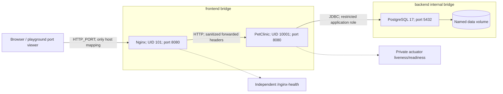

# V1 architecture: containerized PetClinic

Status: implemented and runtime-verified on a real Docker engine (see `docs/validation/v1-containerized.md`).

The application is the copied Spring PetClinic monolith, Java 17 / Spring Boot 4.1.0. This project adds operational infrastructure without editing `src/main` or `src/test`.

| Component | Responsibility |
|---|---|
| Maven wrapper + BuildKit | Build the upstream executable jar; cache Maven dependencies |
| Temurin Alpine JRE | Execute extracted Spring Boot layers as UID/GID 10001 |
| PostgreSQL 17 | Persistent relational data; first-volume initialization creates a restricted app role |
| Nginx unprivileged | One ingress port, header sanitation, body/timeout limits, actuator denial |
| Compose | Networks, health-based startup, resource limits, logs and lifecycle |
| Bash scripts | Repeatable setup/build/deploy/verify/cleanup |

Request flow: browser → Nginx → Spring MVC/JPA → PostgreSQL → named volume. Nginx belongs only to `frontend`; PostgreSQL belongs only to `backend`; the app bridges these networks. App and database have no host port bindings. An internal backend network is not encryption, authentication, or protection from a compromised app.

Startup: PostgreSQL readiness gates app startup; app readiness includes `readinessState,db` and gates Nginx. Nginx's own probe checks only Nginx. Docker health status does not itself restart unhealthy processes; `unless-stopped` restarts exited containers. Runtime dependency outages do not reapply startup ordering.

Shutdown: Java is PID 1; Docker sends SIGTERM directly. Spring graceful shutdown defaults to 30 seconds, with a 40-second Docker stop grace. Heap defaults to 65% of a 768 MiB app limit; native JVM memory and a 128 MiB tmpfs share the remaining container budget. Tune both memory settings together based on measured usage.

Trust boundaries:

- Browser input is untrusted. Nginx overwrites forwarding headers; the app trusts only this proxy because it has no published port. TLS termination in a playground viewer is represented by explicit `PUBLIC_SCHEME=https`, never by trusting arbitrary incoming headers.
- Nginx and app run non-root with read-only root filesystems, bounded `/tmp`, dropped capabilities and no privilege escalation. Application binaries remain root-owned and not writable by UID 10001.
- App exposes only actuator health internally; Nginx denies all actuator paths. No management endpoint is a public API.
- `.env` contains separate random app/admin database passwords with mode 0600. Docker host administrators can inspect environment secrets. Production secret stores and workload identity are future work.
- PostgreSQL uses SCRAM for network authentication. The app role can create its schema tables for upstream SQL initialization but cannot create databases/roles or act as superuser. Enterprise migrations would split schema ownership from the runtime role.

This is a production-style local runtime, not a complete internet production service. It has no user authentication, managed TLS, HA, backup policy, orchestrator recovery or external secret manager. Keep playground access scoped to the lab; use synthetic data.

Ephemeral deployment preserves the same three-component architecture. Only bind address, port and external scheme vary. Named volumes survive `compose down` within a session, not playground destruction. No AWS/Azure/GCP account is needed for V1.
