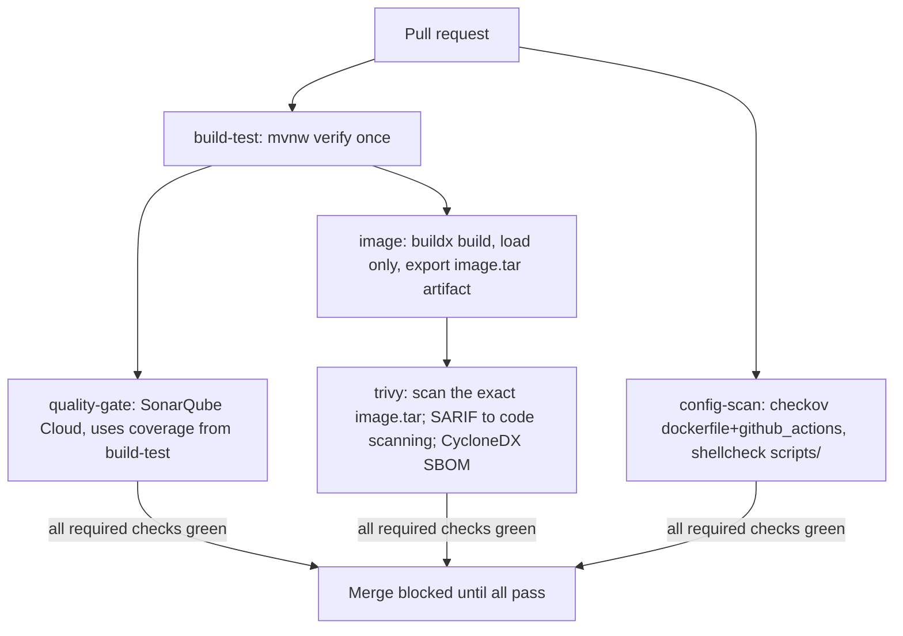
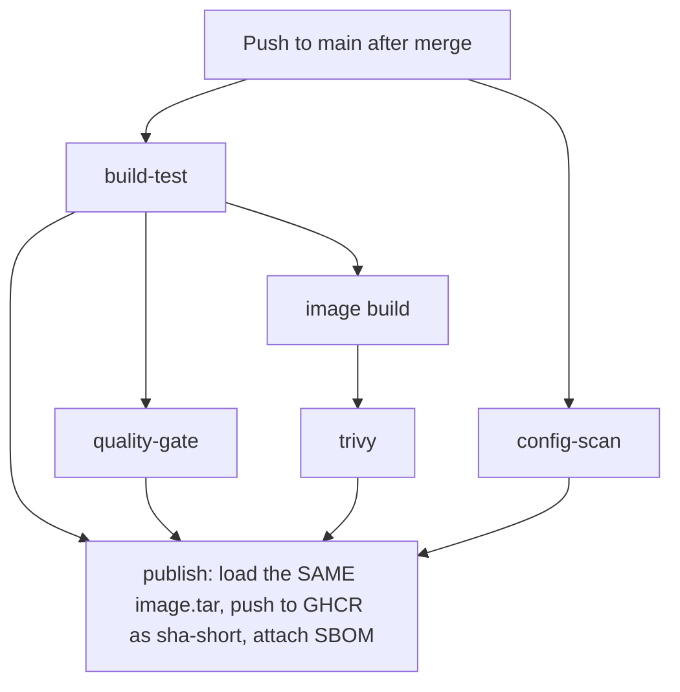
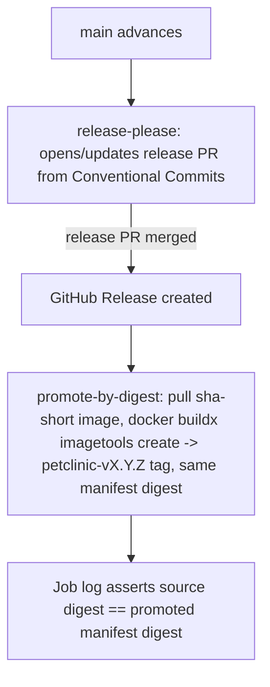

# V2 architecture: CI/CD pipeline

Status: files complete; PENDING RUNTIME VERIFICATION on a real GitHub Actions
run and a real Docker engine (see `docs/validation/v2-cicd.md`).

## PR path

## Main path

## Release path

## Gates

| Gate | Enforced by | Blocks |
|---|---|---|
| Tests pass | `build-test` job (`mvnw verify`) | PR merge (required check) |
| Coverage/code smells | `quality-gate` job (SonarQube Cloud) | PR merge (required check) |
| No fixable CRITICAL CVEs | `trivy` job | PR merge (required check) |
| IaC/config hygiene | `config-scan` job (Checkov + shellcheck) | PR merge (required check) |
| Direct pushes to main | Branch protection (see `docs/branch-protection.md`) | All non-PR pushes |
| Conventional Commit PR titles | Squash-merge + release-please | Deterministic versioning |

## Artifact flow

`build-test` produces the JAR + coverage report as workflow artifacts.
`image` builds one image and exports it as `image.tar` — never pushed on PRs.
`trivy` scans that same `image.tar`, never a separately built image. On push
to main, `publish` loads that identical `image.tar` and pushes it to GHCR as
`sha-<short>` — no second build. `release.yml` never invokes `docker build`;
it pulls `sha-<short>` and retags it to the release's semver tag by digest.
See `docs/adr/0005-build-once-promote-by-digest.md`.

## Self-hosted parity

`ci/compose.yaml` + `Jenkinsfile` run the identical stage contract
(`docs/ci-portability.md`) for environments without GitHub-hosted runner
access: Jenkins orchestrates, a local SonarQube instance (reachable on the
same host network) is the quality gate, and Nexus receives the versioned JAR
instead of GHCR receiving an image push.
